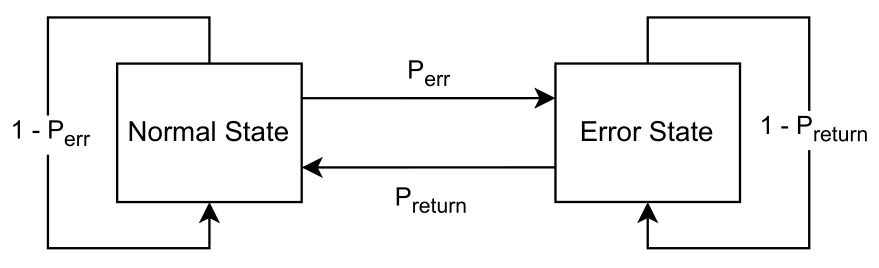
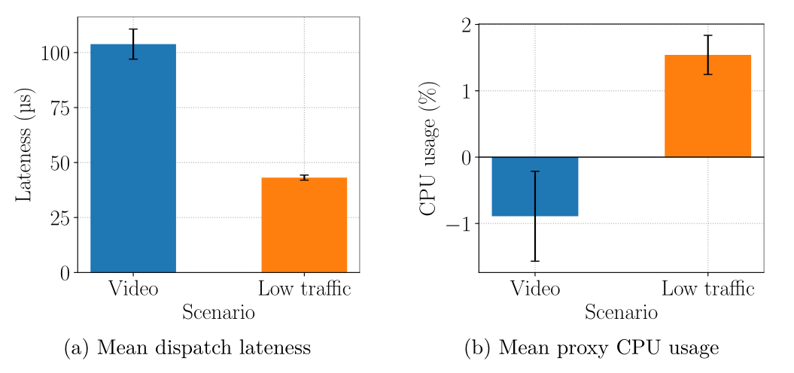
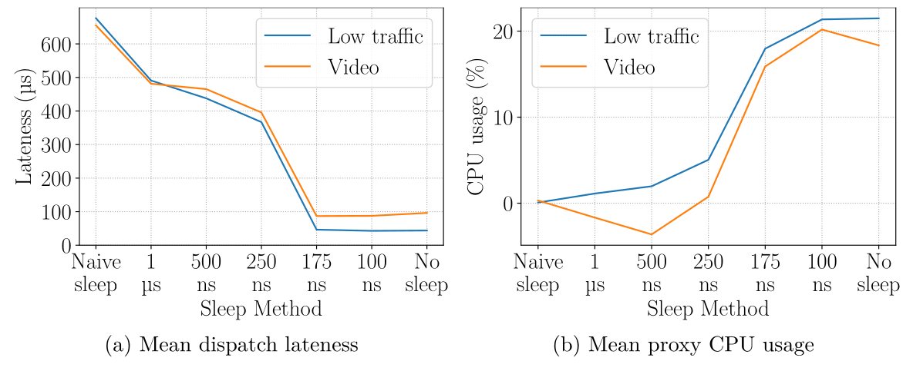

# UDP-WAN-Proxy

A cross-platform UDP proxy for WAN emulation with sub-millisecond performance.

The proxy listens for packets on a given port, emulates WAN conditions like delay, jitter or packet loss, and relays them to another given port.


## Building

From the project root, either run `make` or `go build -o udp-wan-proxy ./src`.


## WAN Emulation Features

**Delay**: Delays all packets by a given time value.

**Jitter**: Randomly delays packets according to a given maximum jitter value.

**Packet loss**: Randomly drop packets according to a given probability. This is implemented in two ways: naive and burst error packet loss.

With naive packet loss, each packet will be randomly dropped according to a given probability.

Burst error packet loss can be used to model more realistic behavior, as packet loss usually occurs in bursts in real world scenarios.
It involves two probabilities $P_{err}$ for transitioning to an error state and $P_{return}$ for leaving the error state.
The application starts in normal, non-error state.
For every packet received, the application uniformly samples $P_{err}$ and transitions to the error state or remains in normal state accordingly.
While in error state, $P_{return}$ is sampled to transition back to normal state or remaining in error state.
Every packet received while the application is in error state will be dropped.

<center></center>


## Usage

See `udp-wan-proxy -h` to get a list of supported arguments.

The following shows some examples for a proxy listening on port 5004 and relaying traffic to port 6004.

```sh
# 500 ms delay + 50 ms jitter
./udp-wan-proxy -l 5004 -r 6004 -d 500 -j 50

# 1% packet loss
./udp-wan-proxy -l 5004 -r 6004 --loss 0.01
# or
./udp-wan-proxy -l 5004 -r 6004 --loss-start 0.01 --loss-stop 0.99

# Burst error packet loss with 0.1% probability of entering error-state and 50% probability of leaving it.
./udp-wan-proxy -l 5004 -r 6004 --loss-start 0.001 --loss-stop 0.5

# Log traffic and performance statistics to stats.csv
./udp-wan-proxy -l 5004 -r 6004 --csv stats.csv
```


## Performance

The proxy provides sub-millisecond performance, but could be optimized further.

The following shows a performance evaluation regarding computation delay and CPU usage.
Two scenarios were tested: a 5-10 MBit/s video stream and a 4 byte UDP message sent every 0.5 seconds.
Lateness depicts the mean time difference between the scheduled time of sending a packet and the actual time of dispatch.
The negative CPU usage likely occurs due to CPU frequency scaling or other scheduling reasons.

<center></center>

The most influential factor for performance turned out to be the sleep function, as it can yield up to 1 ms inaccuracy.
For this reason, an iterative sleep method has been implemented that sleeps repeatedly for smaller amounts, thus providing better accuracy.
The following plot shows the average dispatch lateness and CPU usage in regard to different sleep methods and intervals.
Naive sleep corresponds to the default sleep function.

As 250-500 ns seemed to provide the best tradeoff between lateness and CPU usage, the default has been set to 300 ns.
This value can still be changed using the `-s` flag.

<center></center>


## Video corruption

Video corruption, or data corruption in general, usually occurs with high resolution/quality streams
where the data rate is larger than the maximum OS socket buffer size, hence causing packet loss and
data corruption.

The proxy internally already sets the application socket buffer size to 20 MB, which should suffice in most cases.

To increase the system's maximum socket buffer size to 20 MB, run:
```sh
$ echo 20971520 | sudo tee /proc/sys/net/core/rmem_max
```

To make this setting permanent, open `/etc/sysctl.conf` or create a file
`/etc/sysctl.d/50-socketsize.conf` and add the following content.

```sh
# Increase maximum socket buffer size to 20MB
net.core.rmem_max = 20971520
```

Then run `sudo sysctl --system` to load the new config.


## To-Do

- Bandwidth emulation
- Configurable socket buffer size


## Contributing

Contributions are welcome!
